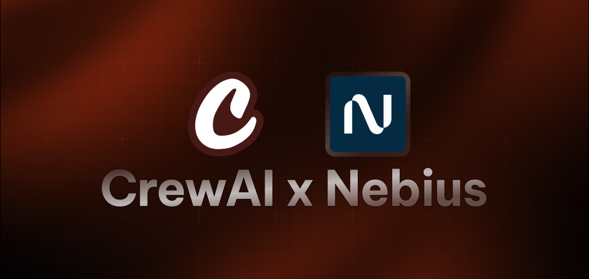

# AI Trend Research with CrewAI

A Python script that uses CrewAI to research and identify the next big trends in artificial intelligence.

## Features

- Utilizes CrewAI's multi-agent framework.
- Implements a senior researcher agent specialized in technology trends.
- Connects to Nebius AI's Qwen3-235B-A22B LLM for research.
- Sequential task execution for focused research.

## Prerequisites

- Python 3.7+
- CrewAI library
- Nebius API key
- dotenv package

## Installation

1. Clone the repository:
   ```bash
   git clone https://github.com/yourusername/ai-trend-research.git
   cd ai-trend-research
   ```

2. Install the required packages:
   ```bash
   pip install -r requirements.txt
   ```

3. Create a `.env` file in the project root and add your Nebius API key:
   ```env
   NEBIUS_API_KEY=your_api_key_here
   ```

## Usage

Run the research script:
```bash
python main.py
```

The script will:
1. Initialize a senior researcher agent.
2. Create a research task to identify AI trends.
3. Execute the task using the Qwen3-235B-A22B model.
4. Output 5 paragraphs about the next big AI trend.

## Configuration

You can modify the following parameters in the script:
- Researcher agent's role, goal, and backstory.
- Research task description and expected output.
- LLM model (currently set to Qwen3-235B-A22B).

## Dependencies

- [crewai](https://github.com/joaomdmoura/crewAI)
- [python-dotenv](https://github.com/theskumar/python-dotenv)
